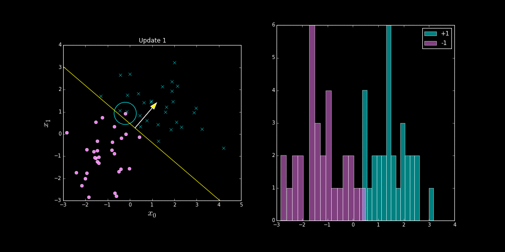

## What is Machine Learning?

* A set of techniques for extracting information from data.

* Principal technology underlying recent advances in *artificial intelligence*.

* A major technology underlying *data science*.

---

## Example: Image Classification

---

## Perceptron

 

---

## Example: AlphaGo

* An achievement in Artificial Intelligence

## Example: Driverless Cars

* Engineered system with many components.
* Many vital components are based on machine learning.
  * Pedestrian recognition (an image classification problem)
  

## Example: Facebook

* Most aspects of the interface controlled using machine learning.

* Ranking of posts in newsfeed.

* Ranking of adverts.

## Machine Learning

**data + model = algorithm**

* Your actions (likes, friends, clicks) are turned into a vector.

$$\mathbf{x}=\begin{bmatrix} 1.0 & 2.3 & 3 \end{bmatrix}$$

## You Will Need

* Training data

* A model of how they interact

* Some computer time

## The Professions

* What aspects cannot/can be replaced by a machine?

	* What makes professions special. 
	
	* Encroachment of automation on 'middle class' roles.

* Not just your role, but the wider societal role.

* How will the professions evolve?

---

## Thanks!

* twitter: @lawrennd
* blog: [http://inverseprobability.com](http://inverseprobability.com/blog.html)
