### Data Science Africa Summer School
### 2017-07-17
### Neil D. Lawrence
### Amazon and University of Sheffield
```@lawrennd``` [inverseprobability.com](http://inverseprobability.com)
<!--  pandoc -s -S -c talks.css -t revealjs --mathjax="http://cdn.mathjax.org/mathjax/latest/MathJax.js?config=TeX-AMS-MML_HTMLorMML" -o 2017-07-17-what-is-machine-learning.slides.html 2017-07-17-what-is-machine-learning.md
-->

# Introduction

* General introduction to machine learning.

* Highlight technical challenges and current solutions.

* What is machine learning? And why is it important?

# Rise of Machine Learning

* Driven by data and computation

* Fundamentally dependent on models

$$
\text{data} + \text{model} + \text{compute} \rightarrow \text{prediction}
$$

# Data Revolution


*Large amounts of data and high interconnection bandwidth mean that we receive much of our information about the world around us through computers.*

# Efficiency

* Economies driven by 'production'.

* Greater production comes with better efficiency.

    * E.g. moving from gathering food to settled agriculture.

* In the modern era one approach to becoming more efficient is automation of processes.

    *  E.g. manufacturing production lines

# Physical Processes

* Manufacturing processes consist of production lines and robotic automation.

* Logistics can also be decomposed into the supply chain processes.

* Efficiency can be improved by automation.

# Goods and Information

* For modern society: management of flow of goods and  information.

* Flow of information is highly automated.

* Processing of data is decomposed into stages in computer code. 

# Intervention

* For all cases:  manufacturing, logistics, data management

* Pipeline requires human intervention from an operator.

* Interventions create bottlenecks, slow the process.

* Machine learning is a key technology in automating these manual stages.

# Long Grass

* Easy to replicate interventions have already been dealt with.

* Components that still require human intervention are the knottier problems.

* Difficult decompose into stages which could then be further automated.

* These components are 'process-atoms'.

* These are the "long grass" regions of technology.

# Nature of Challenge

*  In manufacturing or logistics settings atoms are flexible manual skills.

    * Requires emulation of a human's motor skills.

* In information processing: our flexible cognitive skills.

    * Our ability to mentally process an image or some text. 

# Worked Example: Delivery Drones

[](https://www.youtube.com/watch?v=py8QrZPT48s)


# Data Driven

* Machine Learning: Replicate Processes through *direct use of data*.

* Aim to emulate cognitive processes through the use of data.

* Use data to provide new approaches in control and optimization that should allow for emulation of human motor skills. 

# Process Emulation

* Key idea:  emulate the process as a mathematical function.

* Each function has a set of *parameters* which control its behavior.

* *Learning* is the process of changing these parameters to change the shape of the function

* Choice of which class of mathematical functions we use is a vital component of our *model*. 

# Polynomial Fit {.slide: data-transition="none"}


*Example of prediction: The Olympic gold medalist in the marathon's pace is predicted using a regression fit. In this case the mathematical function is directly predicting the pace of the winner as a function of the year of the Olympics.*

# Polynomial Fit {.slide: data-transition="none"}


*Example of prediction: The Olympic gold medalist in the marathon's pace is predicted using a regression fit. In this case the mathematical function is directly predicting the pace of the winner as a function of the year of the Olympics.*

# Polynomial Fit {.slide: data-transition="none"}

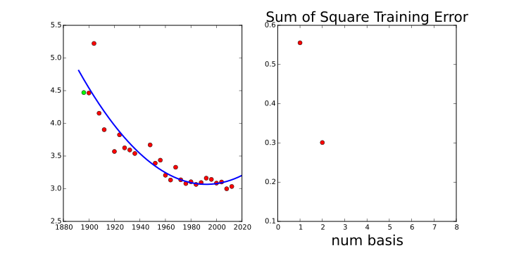

*Example of prediction: The Olympic gold medalist in the marathon's pace is predicted using a regression fit. In this case the mathematical function is directly predicting the pace of the winner as a function of the year of the Olympics.*

# Polynomial Fit {.slide: data-transition="none"}


*Example of prediction: The Olympic gold medalist in the marathon's pace is predicted using a regression fit. In this case the mathematical function is directly predicting the pace of the winner as a function of the year of the Olympics.*

# Polynomial Fit {.slide: data-transition="none"}


*Example of prediction: The Olympic gold medalist in the marathon's pace is predicted using a regression fit. In this case the mathematical function is directly predicting the pace of the winner as a function of the year of the Olympics.*

# Polynomial Fit {.slide: data-transition="none"}

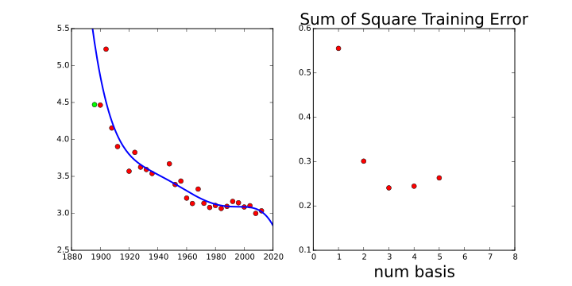

*Example of prediction: The Olympic gold medalist in the marathon's pace is predicted using a regression fit. In this case the mathematical function is directly predicting the pace of the winner as a function of the year of the Olympics.*

# Polynomial Fit {.slide: data-transition="none"}


*Example of prediction: The Olympic gold medalist in the marathon's pace is predicted using a regression fit. In this case the mathematical function is directly predicting the pace of the winner as a function of the year of the Olympics.*

# Artificial Intelligence

* Principal technology underlying the recent advances in artificial intelligence techniques.

* Different approach to that developed in classical artificial intelligence (sometimes referred to as "good old fashioned AI" or GOFAI).

* GOFAI relied on symbolic logic as its mathematical engine.

# Artificial Intelligence

* Early AI used expert systems: a set of logical rules implemented to reconstruct expertise. For example, rules to decide whether or not someone has cancer.

* Such rules prove hard to specify for very complex processes.[^originai] 

[^originai]: GOFAI has its origins in the birth of computer science so it is unsurprising that logic should be the dominant paradigm. There was also a sense in which pure logic felt like it mapped well on to human reasoning. In practice, for any complex real world situation, the number of logical rules required causes an explosion in the *state space* of the system. This makes logical systems intractable in many applications. 

# Data Science

* Can split applications of machine learning broadly into *data science* and *artificial intelligence*.

* *Data science*: making sense of 'new data', the large volumes of data from sensors and increased interconnectivity (big data, IoT)

* Classical statistics: the question is formed first, and data is later.

# Data Science

* Data Science: data is first, questions come later.

* Overlap through *exploratory data analysis*

# Artificial Intelligence

* Artificial intelligence* originates in *cybernetics*

* Challenge to recreate "intelligent" behaviour.

* Either *general intelligence* or emulate *human* capabilities.

* Machine learning is important because of success of data-driven artificial intelligence.

* Data-driven artificial intelligence: instead of solving from first principles, collect data.

# Machine Learning

1 observe a system in practice

2. emulate its behavior with mathematics.

* Design challenge: where to put mathematical function.

* Where it's placed leads to different ML domains.

# Supervised Learning

* Most widely deployed machine learning technology.

    * Particular domain of success has been *classification*.

* Take input to function (e.g. image)

* Use output to place it in a class (e.g. dog or cat).

* Simple idea underpins a lot of machine learning.

# Perceptron {.slide: data-transition="none"}


*Simple classification with the perceptron algorithm.*

# Perceptron {.slide: data-transition="none"}

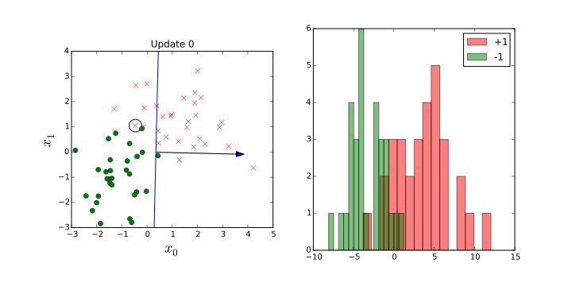

*Simple classification with the perceptron algorithm.*

# Perceptron {.slide: data-transition="none"}


*Simple classification with the perceptron algorithm.*

# Perceptron {.slide: data-transition="none"}

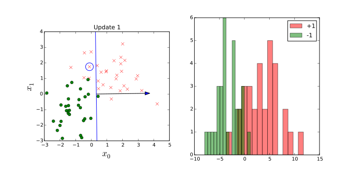

*Simple classification with the perceptron algorithm.*

# Perceptron {.slide: data-transition="none"}

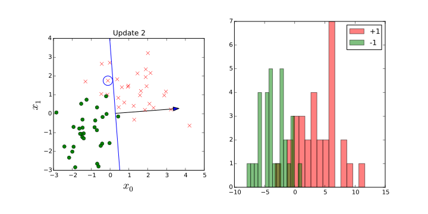

*Simple classification with the perceptron algorithm.*

# Perceptron {.slide: data-transition="none"}

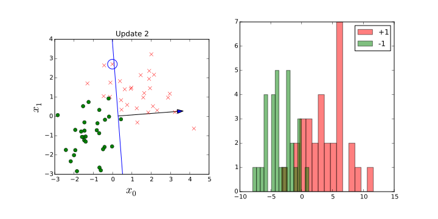

*Simple classification with the perceptron algorithm.*

# Perceptron {.slide: data-transition="none"}

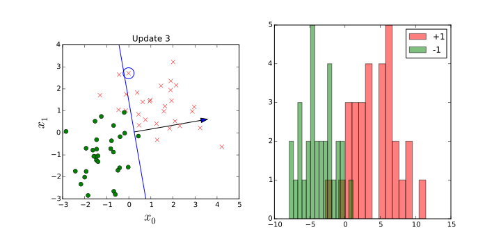

*Simple classification with the perceptron algorithm.*

# Perceptron {.slide: data-transition="none"}

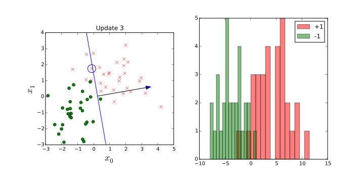

*Simple classification with the perceptron algorithm.*

# Perceptron {.slide: data-transition="none"}

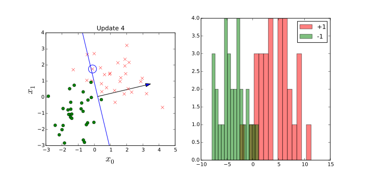

*Simple classification with the perceptron algorithm.*

# Perceptron {.slide: data-transition="none"}


*Simple classification with the perceptron algorithm.*

# Perceptron {.slide: data-transition="none"}


*Simple classification with the perceptron algorithm.*

# Perceptron {.slide: data-transition="none"}

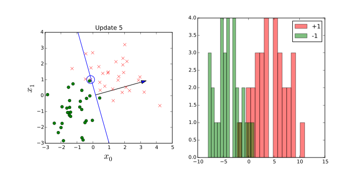

*Simple classification with the perceptron algorithm.*

# Perceptron {.slide: data-transition="none"}

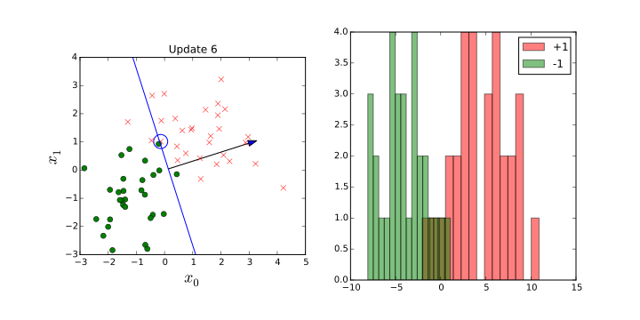

*Simple classification with the perceptron algorithm.*

# Perceptron {.slide: data-transition="none"}


*Simple classification with the perceptron algorithm.*

# Perceptron {.slide: data-transition="none"}


*Simple classification with the perceptron algorithm.*

# Perceptron {.slide: data-transition="none"}

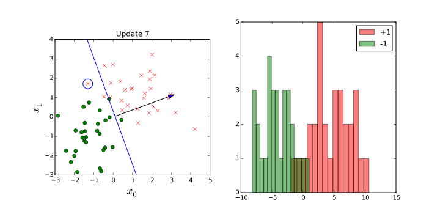

*Simple classification with the perceptron algorithm.*

# Perceptron {.slide: data-transition="none"}


*Simple classification with the perceptron algorithm.*

# Perceptron {.slide: data-transition="none"}

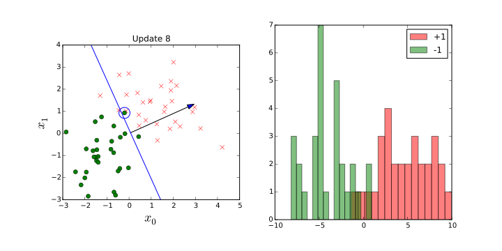

*Simple classification with the perceptron algorithm.*

# Perceptron {.slide: data-transition="none"}


*Simple classification with the perceptron algorithm.*

# Perceptron {.slide: data-transition="none"}


*Simple classification with the perceptron algorithm.*

# Perceptron {.slide: data-transition="none"}

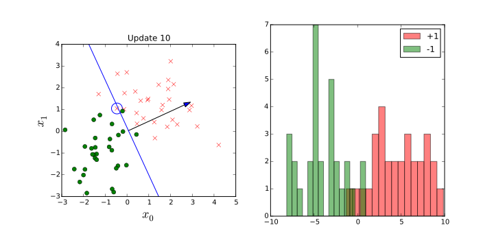

*Simple classification with the perceptron algorithm.*

# Perceptron {.slide: data-transition="none"}


*Simple classification with the perceptron algorithm.*

# Perceptron {.slide: data-transition="none"}


*Simple classification with the perceptron algorithm.*

# Perceptron {.slide: data-transition="none"}

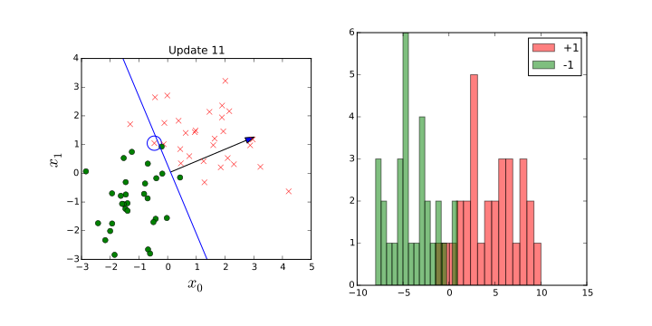

*Simple classification with the perceptron algorithm.*

# Perceptron {.slide: data-transition="none"}

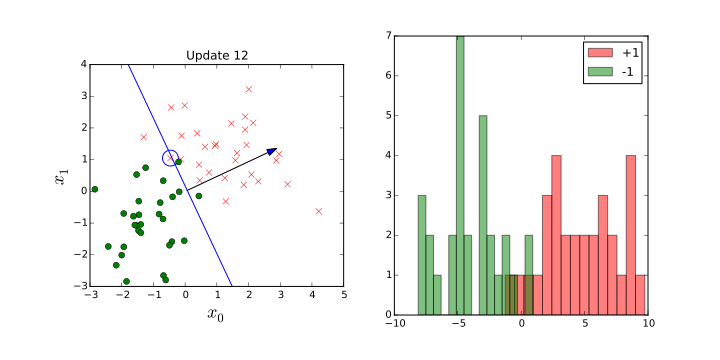

*Simple classification with the perceptron algorithm.*

# Perceptron {.slide: data-transition="none"}


*Simple classification with the perceptron algorithm.*

# Perceptron {.slide: data-transition="none"}

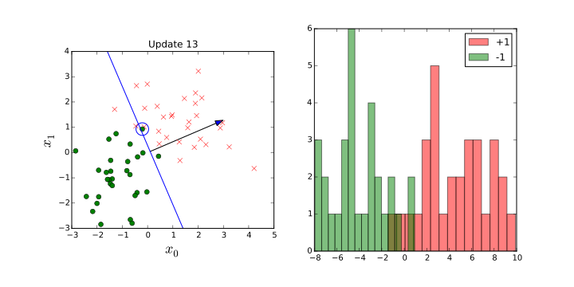

*Simple classification with the perceptron algorithm.*

# Perceptron {.slide: data-transition="none"}

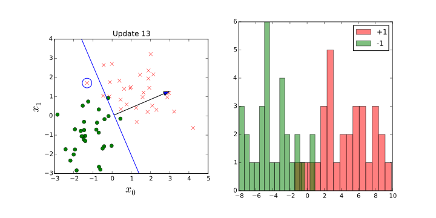

*Simple classification with the perceptron algorithm.*

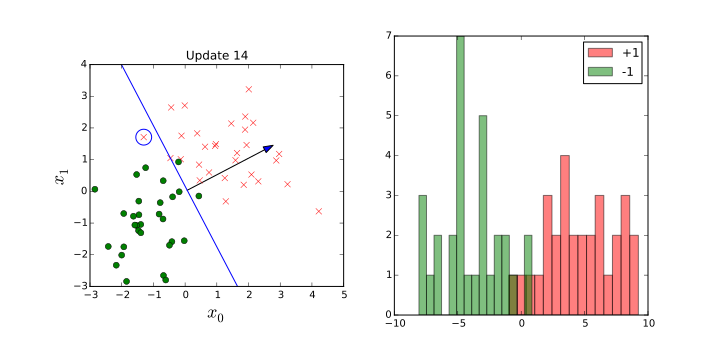

*Simple classification with the perceptron algorithm.*

# Perceptron {.slide: data-transition="none"}

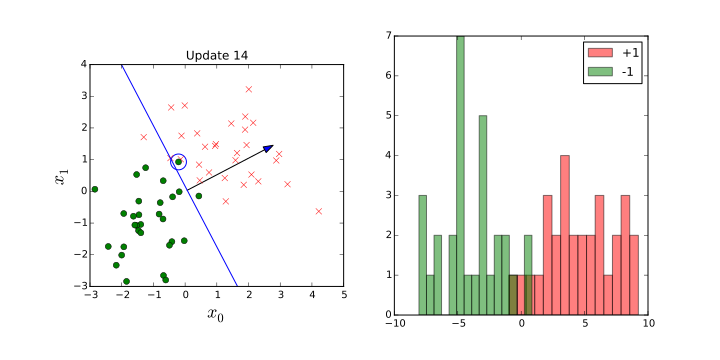

*Simple classification with the perceptron algorithm.*

# Perceptron {.slide: data-transition="none"}

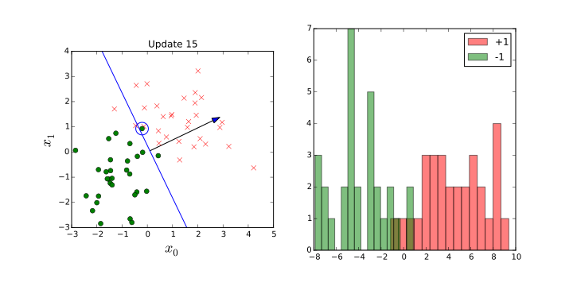

*Simple classification with the perceptron algorithm.*

# Perceptron {.slide: data-transition="none"}

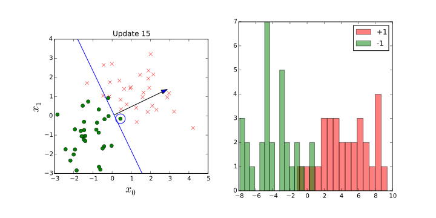

*Simple classification with the perceptron algorithm.*

# Perceptron {.slide: data-transition="none"}


*Simple classification with the perceptron algorithm.*

# Perceptron {.slide: data-transition="none"}

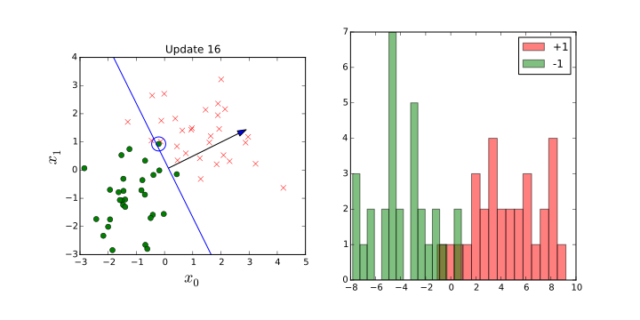

*Simple classification with the perceptron algorithm.*

# Perceptron {.slide: data-transition="none"}


*Simple classification with the perceptron algorithm.*

# Perceptron {.slide: data-transition="none"}

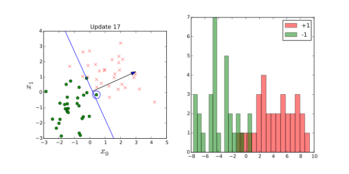

*Simple classification with the perceptron algorithm.*

# Perceptron {.slide: data-transition="none"}

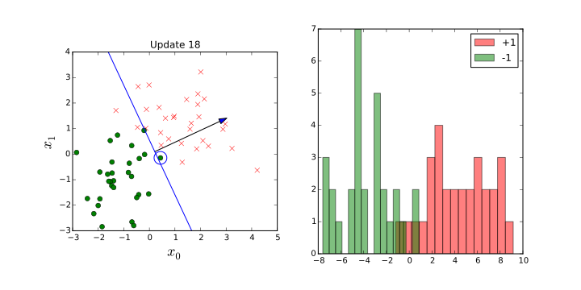

*Simple classification with the perceptron algorithm.*

# Perceptron {.slide: data-transition="none"}

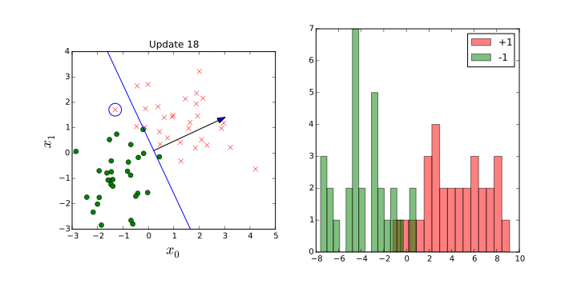

*Simple classification with the perceptron algorithm.*

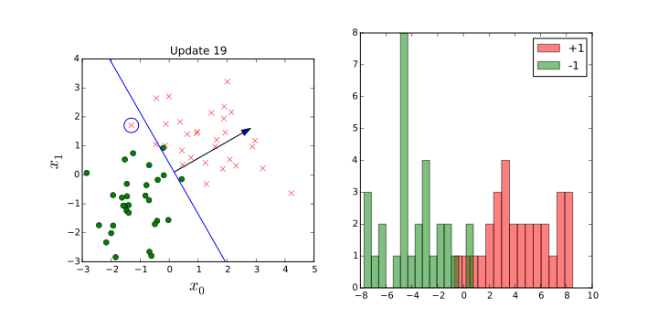

*Simple classification with the perceptron algorithm.*

# Perceptron {.slide: data-transition="none"}


*Simple classification with the perceptron algorithm.*

# Perceptron {.slide: data-transition="none"}

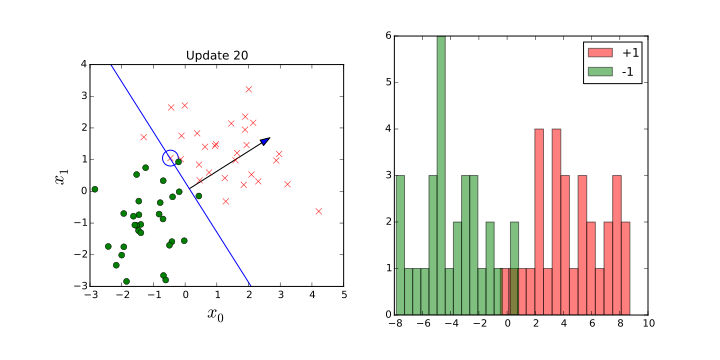

*Simple classification with the perceptron algorithm.*

# Perceptron {.slide: data-transition="none"}

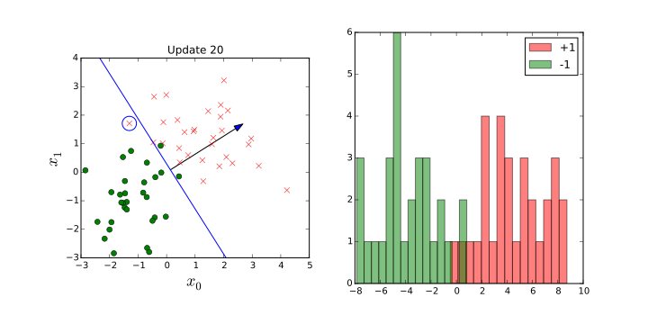

*Simple classification with the perceptron algorithm.*

# Perceptron {.slide: data-transition="none"}


*Simple classification with the perceptron algorithm.*

# Perceptron {.slide: data-transition="none"}

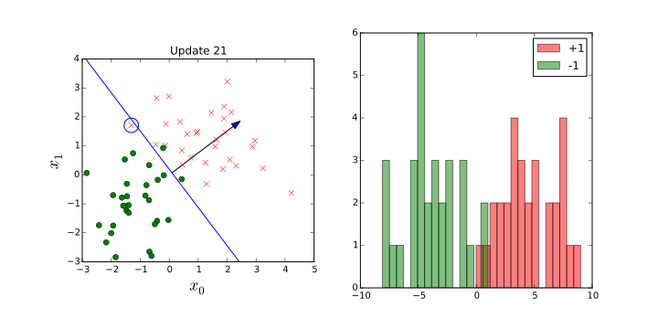

*Simple classification with the perceptron algorithm.*


# Classification

* Examples in a speech based intelligent agent:  *wake word* classification.

* Major breakthrough for images was in 2012 with the ImageNet result of [Alex Krizhevsky, Ilya Sutskever and Geoff Hinton](http://papers.nips.cc/paper/4824-imagenet-classification-with-deep-)

* ImageNet is a large data base of 14 million images with many thousands of classes.

* Data is used in a community-wide challenge for object categorization.

* Krizhevsky et al used *convolutional neural networks*.

# Supervised Learning

* Inputs, $\mathbf{x}$, mapped to a label, $y$, through a function $f(\cdot)$ d dependent on parameters, $\mathbf{w}$, 

$$
y = f(\mathbf{x}; \mathbf{w}).
$$

* $f(\cdot)$ is known as the *prediction function*.

# Supervised Learning Challenges

1. choosing which features, $\mathbf{x}$, are relevant in the prediction

2. defining the appropriate *class of function*, $f(\cdot)$.

3. selecting the right parameters, $\mathbf{w}$. 

# Feature Selection

* Olympic prediction example only using year to predict pace.

* Could also use *course characteristics* (e.g. how hilly) *temperature*. 

* Can use *feature selection algorithms*

* Automate the process of finding the features that we need.

# Applications

*  rank search results,  decide which adverts to serve or, what appears at the top of your newsfeed.

* Facebook features include number of likes, whether it's got an image, whether this is a friend you interact with.

* Newsfeed ranking algorithm is critical to Facebook's success.

* Heavy investments in machine learning pipelines for evaluation of the feature utility. 

# Class of Function, $f(\cdot)$

* What should be the characteristics of the mapping between $\mathbf{x}$ and $y$?

* Often we choose it to be *smooth* (similar inputs lead to similar outputs).

* Often choose it to be a linear function.

* In *forecasting* we might want a *periodic* function (weekly or seasonal effects).

# Class of Function: Neural Networks

* For imagenet prediction function was a *convolutional neural network*

* A convolutional neural network introduces *invariances* into the function that are particular to image classification.

# Class of Function: Invariances

* An invariance is a transformation of the input that we don't want to effect the output.

    * e.g. a cat remains a cat regardless of location (translation), size (scale) or upside-down (rotation and reflection).

    * Convolutional neural networks encode invariances in the mathematical function. 

# Encoding Knowledge

* Encoding invariance is like encoding knowledge in the model.

* If we don't specify these invariances then the model must learn them.

* Learning invariances requires a *lot* more data.

* The amount of data required to achieve a certain performance is the *data efficiency*.

# Choosing Prediction Function

* Prediction function can be any set of parameterized functions.

* In the Olympic marathon example above we used a polynomial fit,

$$
f(x) = w_0 + w_1 x+ w_2 x^2 + w_3 x^3 + w_4 x^4.
$$

* Olympic example is a supervised learning challenge. But it is a *regression* problem.

* A regression problem is one where the output is a continuous value (such as the pace in the marathon).


# Regression Problems

* In classification the output of prediction function is constrained to be discrete.

* An early example of a regression data set used in machine learning was [the Tecator data](http://lib.stat.cmu.edu/datasets/tecator)

    * Fat, water and protein content of meat samples was predicted as a function of the absorption of infrared light. 


# Parameter Estimation: Objective Functions

* After choosing *features* and *function class* we need *parameters*.

* Estimate $\mathbf{w}$  by specifying an *objective function*.

* The objective function specifies the quality of the match between the prediction function and the *training data*.

* In supervised learning the objective function has input data (for ImageNet, the image, for Olympic marathon the year) and a *label*. 

# Labels and Squared Error

* *Label* is where the term supervised learning comes from.

* Idea is that a supervisor, or annotator, has already given labels.

* For regression problem, a typical objective function is the *squared error*,

$$
E(\mathbf{w}) = \sum_{i=1}^n (y_i - f(\mathbf{x}_i))^2
$$

# Data Provision

* Here the data is provided to us as a set of $n$ inputs, $\mathbf{x}_1$, $\mathbf{x}_2$, $\mathbf{x}_3$, $\dots$, $\mathbf{x}_n$

* Each data point with an associated label, $y_1$, $y_2$, $y_3$, $\dots$, $y_n$.

* Sometimes the label is cheap to acquire.

     * E.g. in Newsfeed ranking Facebook are acquiring a label each time a user clicks on a post in their Newsfeed. (Data Science?)

     * In ad-click prediction labels are obtained whenever an advert is clicked.

# Annotation

* Often we have to employ human annotators to label the data.

    * E.g. in ImageNet, the breakthrough deep learning result was annotated using Amazon's Mechanical Turk. (AI?)

* Without large scale human input, would not have the breakthrough results in AI we have today. 


# Annotation

* Some tasks *easier* to annotate than *others.

    * For Tecator data, need to acquire the actual values of water, protein and fat content in the meat samples.

    * Each data point requires real experiments

# Annotation

* Even for *easy* tasks there will be problems.
 
    * E.g. humans extrapolate the context of an image.

* Quality of any machine learning solution is very sensitive to the quality of annotated data we have.

* Investing in processes and tools to improve annotation of data is therefore a strong priority. 

# Misrepresentation

* Can be significant problems with misrepresentation in the data sets.

* If data isn't collected carefully, it can reflect biases about the population that we don't want our models to have.

* A face detector using Californians may not perform well when deployed in Kampala, Uganda. 

# Automation

* Train  supervised learning system, place it in production

* Supervised learning is probably the dominant approaches to learning.

* Cost and time associated with labeling data is a major bottleneck for deploying machine learning systems.

* Creating training data requires significant human effort.

# Training and Test

* Very important distinction.

    * Separation between training data and test data (or production data).

* Training data is the data that was used to find the model parameters.

* Test data (or production data) is the data that is used with the live system.

* Ability of a machine learning system to predict well in production is known as its *generalization* ability.

* System's ability to predict in areas where it hasn't previously seen data.


# Generalization Error

* Easy to develop a prediction function that reconstructs the training data exactly: a look up table. you can just use a look up table.

* How would the lookup table predict *between* the training data, where examples haven't been seen before?

* Choice of the class of prediction functions is critical in ensuring that the model generalizes well. 

* Generalization error is normally estimated by applying the objective function to a set of data that the model *wasn't* trained on: the *test data*.

# Performance

* To ensure good performance we normally want a model that gives us a low generalization error.

* If we weren't sure of the right prediction function to use then we could try 1,000 different prediction functions.

* We could use the one that gives us the lowest error on the test data.

* But you have to be careful.


# Validation and Model Selection

* Selecting a model in this way is like a further stage of training where you are using the test data in the training.[^trainingtest]

* It is known as *validation*.

* The error is known as *validation error*.

*  Using the validation error for model selection is a standard machine learning technique.

# Difficult Trap

* All machine learning practitioners should know not to use the test data in your training procedure.

* But because validation data is used for model selection, it is not an unbiased estimate of the generalization performance.

[^trainingtest]: Using the test data in your training procedure is a major error in any machine learning procedure. It is extremely dangerous as it gives a misleading assessment of the model performance. The [Baidu ImageNet scandal](http://inverseprobability.com/2015/06/04/baidu-on-imagenet) was an example of a team competing in the ImageNet challenge which did this. The team had announced via the publication pre-print server Arxiv that they had a world-leading performance on the ImageNet challenge. This was reported in the mainstream media. Two weeks later the challenge organizers revealed that the team had created multiple accounts for checking their test performance more times than was permitted by the challenge rules. This was then reported as "AI's first doping scandal". The team lead was fired by Baidu. 


# Overfitting

[](https://www.youtube.com/watch?v=py8QrZPT48s&t=4m0s)

*Alex Ihler on Polynomials and Overfitting*


# Unsupervised Learning

* When you have data, $\mathbf{x}$, but no labels $y$.

* Extract *structure* from data.

* Type of structure you are interested dependent on the broader context of the task.

# Context

* Supervised learning:  context is very much driven by the labels.

* Humans easily sort objects  e.g. animals and vehicles

* For large data sets or data we are not used to (high dimensional data) would like to automate.

    * E.g., an e-commerce company algorithm for sorting products into groups.

# Discrete vs Continuous

* Supervised learning is broadly divided into classification and regression

* Unsupervised learning can be split too:

1.  methods that cluster the data

2. methods that represent the data as (lower dimensional) continuous values. 

# Clustering

* *Task*:  associate each data point with a different label.

* Label is *not* provided.

* Quite intuitive for humans, we do it naturally.

# Platonic Ideals

* Names for animals originally invented by humans through 'clustering'

* Can we have the computer to recreate that process of inventing the label?

* Greek philosopher, Plato, thought about ideas, he considered the concept of the Platonic ideal.

* Platonic ideal bird is the bird that is most bird-like or the chair that is most chair-like.

# Cluster Center

* Can define different clusters, by finding their Platonic ideal (known as the cluster center)

* Allocate each data point to the relevant nearest cluster center.

* Allocate each animal to the class defined by its nearest cluster center.

# Similarity and Distance Measures

* Define a notion of either similarity or distance between the objects and their Platonic ideal.

* If objects are vectors of data, $\mathbf{x}_i$.

* Represent cluster center for category $j$ by a vector $\mathbf{m}_j$.

* This vector contains the ideal features of a bird, a chair, or whatever category $j$ is.

# Similarity or Distance

* Can either think in terms of similarity of the objects, or distances.

* We want objects that are similar to each other to cluster together. We want objects that are distant from each other to cluster apart.

* Use mathematical function to formalize this notion, e.g. for distance

$$
d_{ij} = f(\mathbf{x}_i, \mathbf{m}_j).
$$

# Squared Distance


* Find cluster centers that are close to as many data points as possible.

* A commonly used distance is the squared distance,

$$
d_{ij} = (\mathbf{x}_i - \mathbf{m}_j)^2.
$$

* Already seen for regression.

# Objective Function

* Given similarity measure, need number of  cluster centers, $K$.

* Find their location by allocating each center to a sub-set of the points and minimizing the sum of the squared errors,

$$
E(\mathbf{M}) = \sum_{i \in \mathbf{i}_j} (\mathbf{x}_i - \mathbf{m}_j)^2
$$

here $\mathbf{i}_j$ is all indices of  data points allocated to the $j$th center. 

# $k$-Means Clustering

* *$k$-means clustering* is simple and quick to implement.

* Very *initialisation* sensitive.

# Initialisation

* Initialisation is the process of selecting a starting set of parameters.

* Optimisation result can depend on the starting point.

* For $k$-means clustering you need to choose an initial set of centers.

* Optimisation surface has many local optima, algorithm gets stuck in ones near initialisation.

# $k$-Means Clustering {.slide: data-transition="none"}


*Clustering with the $k$-means clustering algorithm.*

# $k$-Means Clustering {.slide: data-transition="none"}


*Clustering with the $k$-means clustering algorithm.*

# $k$-Means Clustering {.slide: data-transition="none"}


*Clustering with the $k$-means clustering algorithm.*

# $k$-Means Clustering {.slide: data-transition="none"}

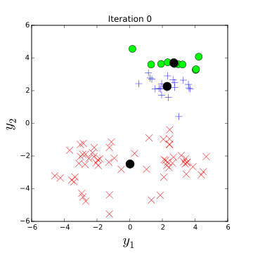

*Clustering with the $k$-means clustering algorithm.*

# $k$-Means Clustering {.slide: data-transition="none"}


*Clustering with the $k$-means clustering algorithm.*

# $k$-Means Clustering {.slide: data-transition="none"}


*Clustering with the $k$-means clustering algorithm.*

# $k$-Means Clustering {.slide: data-transition="none"}


*Clustering with the $k$-means clustering algorithm.*

# $k$-Means Clustering {.slide: data-transition="none"}


*Clustering with the $k$-means clustering algorithm.*

# $k$-Means Clustering {.slide: data-transition="none"}


*Clustering with the $k$-means clustering algorithm.*

# $k$-Means Clustering {.slide: data-transition="none"}


*Clustering with the $k$-means clustering algorithm.*

# $k$-Means Clustering {.slide: data-transition="none"}


*Clustering with the $k$-means clustering algorithm.*

# $k$-Means Clustering {.slide: data-transition="none"}


*Clustering with the $k$-means clustering algorithm.*

# $k$-Means Clustering {.slide: data-transition="none"}


*Clustering with the $k$-means clustering algorithm.*

# $k$-Means Clustering {.slide: data-transition="none"}


*Clustering with the $k$-means clustering algorithm.*

# $k$-Means Clustering

[](https://www.youtube.com/watch?v=mfqmoUN-Cuw)

# Hierarchical Clustering

* Form taxonomies of the cluster centers

* Like humans apply to animals, to form *phylogenies*

[](https://www.youtube.com/watch?v=OcoE7JlbXvY)

# Phylogenetic Trees

* Perform a hierarchical clustering based on genetic data, i.e. the actual contents of the genome.

* Perform across a number of species and produce a *phylogenetic tree*.

* Represents a guess at actual evolution of the species.

* Used to estimate the origin of viruses like AIDS or Bird flu

# Product Clustering

* Could apply hierarchical clustering to Amazon's products.

* Would give us a phylogeny of products.

* Each cluster of products would be split into sub-clusters of products until we got down to individual products.

    * E.g. at high level Electronics/Clothing

# Hierarchical Clustering Challenge

* Many products belong in more than one cluster: e.g. running shoes are 'sporting goods' and they are 'clothing'.

* Tree structure doesn't allow this allocation.

* Our own psychological grouping capabilities are in cognitive science.

    * E.g. Josh Tenenbaum and collaborators cluster data in more complex ways.

# Dimensionality Reduction

* Compress the data by replacing the original data with reduced number of continuous variables.


*We observe pose, $\mathbf{x}$, puppeteer's hand, $\mathbf{z}$ remains hidden to us.*

# Dimensionality Reduction

* Position of each body part of a marionette could be thought of as our data, $\mathbf{x}_i$.

* Each data point is the 3-D co-ordinates of all the different body parts 

* Movement of parts determined by puppeteer via strings.

* For a simple puppet with one stick can move the stick up and down, left and right and twist.

# Dimensionality Reduction

* This gives three parameters in the puppeteers control.

* Implies that the puppet we see moving is controlled by only 3 variables.

* These 3 variables are often called the hidden or *latent variables*. 

* Assume similar for real world data, observations are derived from lower dimensional underlying process

# Examples in Social Sciences

* Underpins *psychological scoring* such as *IQ* or *personality tests*

* Myers-Briggs assumes personality is four dimensional.

* Political belief (left/right wing).

* Also language modelling has taken similar approaches: [word2vec](https://arxiv.org/abs/1301.3781) 

# Principal Component Analysis

* Principal component analysis (PCA) a linear dimensionality reduction technique

* In Hotelling's formulation of PCA: a assume $\mathbf{x}$ is a linear weighted sum of the latent factors of interest.

* E.g. IQ test we would try and predict subject $i$'s answer to the $j$th question with the following function

$$
x_{ij} = f_j(z_i; \mathbf{w}).
$$

$z_i$ would be the IQ of subject $i$ and $f_j(\cdot)$ would function relating IQ and question answer.

# Hotelling's PCA

* Assume function is linear function. This idea is taken from a wider field known as *factor analysis*, so Hotelling described the challenge as

$$
f_j(z_i; \mathbf{w}) = w_j z_i
$$

* Answer to the $j$th question is predicted to be a scaling of the subject's IQ.

* Scale factor is given by $w_j$.

# Higher Latent Dimensions

* For more latent dimensions matrix of scales, $\mathbf{W}$

$$
f_j(\mathbf{z}_i; \mathbf{W}) = w_{1j} z_{1i} + w_{2j} z_{2i}
$$

*  $z_{1i}$ might be extrovert/introvert and $z_{2i}$ might rational/perceptual


# Parameters

* Parameters $\mathbf{W}$ are known as the factor *loadings* in FA.

* In PCA they are known as the principal components.

* To fit the model need *loadings*, $\mathbf{W}$, and latent variables, $\mathbf{Z}$.

* Can use least squares (leads to *matrix factorization* and recommender systems).

* Recommender systems most elements of $\mathbf{x}_i$ are missing.

# Probability

* PCA and factor analysis the unknown latent factors are dealt with through a probability distribution.

* Assume these "unknowns" are  drawn from a zero mean, unit variance normal distribution.

* That implies a particular *probability* density for data (PDF).

* The PDF has parameters depending on factor loadings to be estimated.


# Maximum Likelihood

* Fit model by "maximising likelihood of data" under the PDF.

* Maxium likelihood for  PCA is the *eigenvalue decomposition* of the data covariance matrix.

* Algorithmically simple and convenient, but slow to compute for very large data sets with many features and many subjects.

# Principal Component Analysis

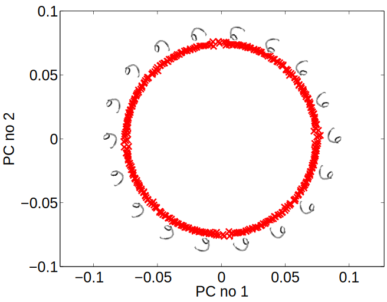

*Visualization of the first two principal components of an artificial data set. The data was generated by taking an image of a handwritten digit, 6, and rotating it 360 times, one degree each time. The first two principal components have been extracted in the diagram. The underlying circular shape is derived from the rotation of the data. Each image in the data set is projected on to the location its projected to in the latent space.*

# Reinforcement Learning

* The final domain of learning we will review is known as reinforcement learning. 

* Many researchers seem to believe is offering a route to *general intelligence*.

* Idea of general intelligence is develop algorithms that are adaptable to many different circumstances.

# Reinforcement Learning

* Supervised learning algorithms are designed to resolve particular challenges.

* Data is annotated with those challenges in mind.

* Unsupervised attempts to build representations without any context. 

# "Reward"

* In reinforcement learning some context is given, in the form of a reward. But it is often *delayed*

* Credit allocation problem: many actions that affected the outcome, but which actions had a positive effect and which a negative effect?

# A/B Testing and Reward

* Advert clicks can be seen as a reward.

* Testing the customer experience, A/B testing, prioritises short term reward.

* The internet is currently being driven by short term rewards which make it distracting in the short term, but perhaps less useful in the long term.

* Click-bait is an example, but there are more subtle effects.

* Success of Facebook is driven by its ability to draw us in when likely we should be doing something else. This is driven by large scale A/B testing. 

# Longer Term

* One open question is how to drive non-visual interfaces through equivalents to A/B testing.

* Speech interfaces, such as those used in intelligent agents, are less amenable to A/B testing when determining the quality of the interface.

* Improving interaction with them is therefore less exact science than the visual interface.

# Data Efficiency

* Data efficient reinforcement learning methods are likely to be key to improving these agent's ability to interact.

* However, they are not yet mature enough to be deployed yet. 

# Game Play

* Reinforcement learning methods have been deployed with high profile success is game play.

* Reward is delayed to the end of the game, victory or defeat.

* Can acquire lots of data through simulation.

* Many of the recent advances in reinforcement learning have occurred with methods that are not data efficient. 

# DeepMind

* The company DeepMind is set up around reinforcement learning as an approach to general intelligence.

* Best known achievements are centered around artificial intelligence in game play.

* For example, Atari game play and AlphaGo. 

# Deep Q Learning

* DeepMind uses an approach to Machine Learning where there are two mathematical functions at work.

* The *policy function* determines the action to be taken at any given moment,

* The *value function* estimates the quality of a board position at any given time.

* In AlphaGo make use of convolutional neural networks for both these models. 

# AlphaGo

* Go was considered a challenge for artificial intelligence for two reasons.

1. Game tree has a very high `branching factor'.

    In Go, there are so many legal moves that the game tree increases exponentially. 

2. Evaluating the quality of any given board position was deemed to be very hard.[^chess].

* AlphaGo played more than 30,000,000 games to learn value and policy.

# Model Based Approach

* An alternative approach to reinforcement learning is to use a prediction function.

* This is similar to *classical control* and field of *system identification*.

* Known as *model based* reinforcement learning.

# Optimization Methods

* Reinforcement learning can also used to improve user experience.

* Reward is gained when the user buys a product from us.

* This makes it closely allied to the area of optimization.

* Optimization of our user interfaces is like reinforcement learning task, but normally approached through *Bayesian optimization* or *bandit learning*.

# Optimization

* Normal optimization we have a mathematical representation of our objective function as a direct function of the parameters.

* In Bayesian Optimization we don't.

* E.g. Examples in this form of optimization include:

1. What is the best user interface for presenting adverts?

2. What is the best design of wing for an F1 car?

3. Which product should I return top of the list in response to this user's search?

# Bayesian Optimization

* Can't directly relate the parameters in the system of interest to our objective through a mathematical function.

* E.g. What is the mathematical function that relates a user's experience to the probability that they will buy a product? 

# Bayesian Optimization

* Use machine learning to develop a  *surrogate model* for the optimization task.

* Surrogate model is a prediction function that attempts to recreate the process we are finding hard to model.

* Try to simultaneously fit the surrogate model and optimize the process.

# Surrogate Models

* Bayesian optimization methods use a *surrogate model* (normally a specific form of regression model).

* Use this to predict how the real system will perform.

* Optimize in the surrogate model. 


# Conclusion

* Introduce range of ML approaches.

* Focussed on where they use mathematical functions as a general overview.

# Deployment

* Introduced almost in order of difficulty of deployment.

* Supervised learning requires more data annotation, but more straightforward to deploy.

* Therefore major focus with supervised learning should always be on maintaining data quality.

# Where to Deploy

* 
> If a typical person can do a mental task with less than one second of thought, we can probably automate it using AI either now or in the near future.[^ngquote]
>
> Andrew Ng

# Is this Right?

* Broadly agree with this quote but only in the context of supervised learning.

* The picture with regard to unsupervised learning and reinforcement learning is more clouded. 

# Getting Easier

* We seem to be moving beyond the era where very deep machine learning expertise is required to deploy methods.

* Just require a  solid understanding of machine learning (say to Masters level)

# Streaming Data

* Supervised machine learning solutions are normally trained offline.

* They do not adapt when deployed because this makes them less verifiable.

* This compounds the brittleness of our solutions.

# Model Choice

* For  all machine learning methods is the initial choice of useful classes of functions.

* The deep learning revolution is associated with a particular class of mathematical functions.
